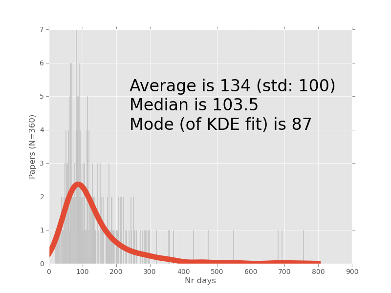

How long do papers take to review?

Too long.

No, seriously, how long? I did a little measurement.

I downloaded the 360 most recent papers from Plos One (as of Friday). They are
all annotated with *submission* and *acceptance* dates, so it was easy to just
compute the differences.

The plot below is a histogram (one bin per day) in grey with a Kernel density
estimate as a solid line.

§

The result is **it takes about 3 to 4 months to get a paper accepted, but with
substancial variance**.

§

Looking at the figure, I had to ask who the poor people were who published that
paper which was longest in revision.

    Alternative Sigma Factor Over-Expression Enables Heterologous Expression of
    a Type II Polyketide Biosynthetic Pathway in *Escherichia coli* by 
    David Cole Stevens, Kyle R. Conway, Nelson Pearce, Luis Roberto
    Villegas-Peñaranda, Anthony G. Garza, and Christopher N. Boddy.
    DOI: `10.1371/journal.pone.0064858 <http://www.plosone.org/article/info%3Adoi%2F10.1371%2Fjournal.pone.0064858>`__

Submitted on *29 March 2011* and accepted on *22 April 2013*, this paper was
755 days in revision.

The fastest acceptance was `only 19 days
<http://www.plosone.org/article/info:doi/10.1371/journal.pone.0064936>`__.
However, this being Plos One, it is possible that the paper had been reviewed
for another Plos journal, rejected with positive reviews on significance
grounds, and had those reviews transferred to Plos One.

§

This is a gimmick. There is perhaps a paper to be written where this is
extended to see what areas of research/keywords/&c matter to acceptance time.
If I had more free time I might write that paper.

The code for the above is `available on github
<https://github.com/luispedro/plosacceptance>`__.

