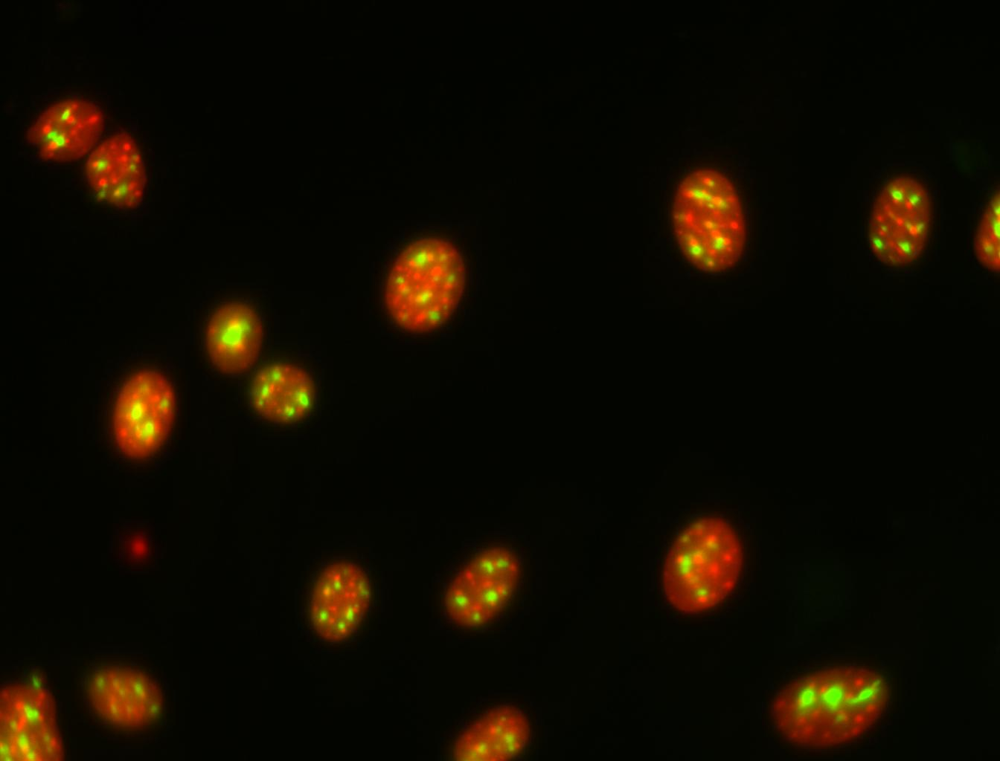

    **Luis Pedro Coelho**, Joshua D. Kangas, Armaghan Naik, Elvira
    Osuna-Highley, Estelle Glory-Afshar, Margaret Fuhrman, Ramanuja Simha,
    Peter B. Berget, Jonathan W. Jarvik, and Robert F.  Murphy, *Determining
    the subcellular location of new proteins from microscope images using local
    features* in Bioinformatics, 2013 [`DOI
    <http://dx.doi.org/10.1093/bioinformatics/btt392>`__]

I will have a series of blog posts on all the ideas on this paper. This first
one will have the background to the work.

Here is a *cartoon view* of a eukariotic cell, taken from `Wikipedia
<http://en.wikipedia.org/wiki/Eukaryote#Cell_features>`__.

.. image:: http://upload.wikimedia.org/wikipedia/commons/thumb/4/48/Animal_cell_structure_en.svg/500px-Animal_cell_structure_en.svg.png

It has several organelles: the nucleus, the Golgi apparatus, the endoplasmic
reticulum (ER), &c Proteins will travel to their assigned locations to perform
their tasks.

§

We would like to know where proteins locate. The best way to do so conclusively
is to somehow image the protein in cells, which we can do with fluorescent
microscopy. The image below is exactly the result of one such experiment. In
green, we see a protein which has been tagged with GFP (see below for technical
details). In red, we see a nuclear marker (thus you can recognize this a a
nucleolar protein).

The **subcellular location determination problem** is to go from image such as
these to location assignments. It is done using pattern recognition.

**Technical details**: The image above is of NIH 3T3 cells where proteins have
been tagged (using CD tagging) to generate cell lines where proteins are now
chimeric and contain a GFP cassette.

**References**

`This was the introduction of automated subcellular location analysis <10.1093/bioinformatics/17.12.1213>`__

`This is a semi-recent review paper by yours truly <http://dx.doi.org/10.1007/978-3-642-13131-8_2>`__

