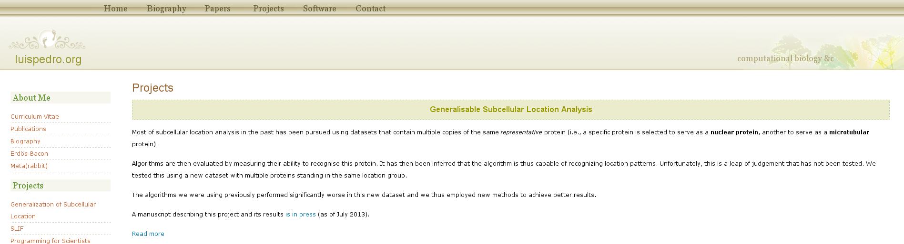

Minor tweak to my webpage

I was looking at `my webpage <http://luispedro.org>`__ this week-end. I updated
many things in terms of content. But one interesting change is that the main
content block now has a maximal width.

Five years ago, when I first took an CSS file off the internet and adapted to
my usees, on a small laptop, having a website which filled the whole screen
seemed appropriate. On today's large screens, it can look ridiculous.

So I added the following little fix::

    #content {
        max-width: 800px;
    }

Here is what the `projects page <http://luispedro.org/projects>`__ used to look
like on a wide screen:

You can see that each paragraph almost fits on a single line.

Here is what is looks like now:

This now seems like normal text.
