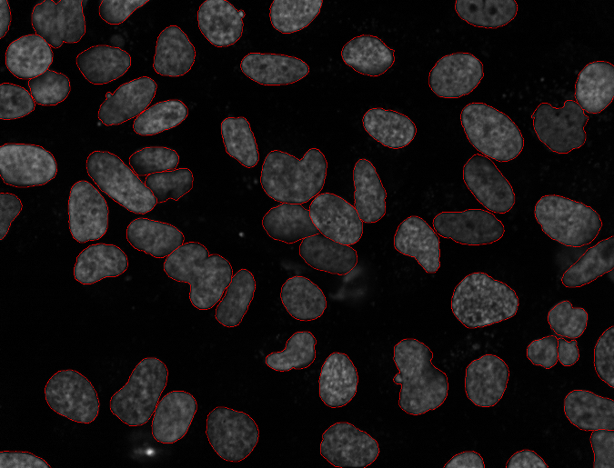

I decided to blog all my old papers (from when I did not have a science blog).
Expect the next few weeks to go back to the past.

I will start with this one:

    NUCLEAR SEGMENTATION IN MICROSCOPE CELL IMAGES: A HAND-SEGMENTED DATASET
    AND COMPARISON OF ALGORITHMS by *Luis Pedro Coelho, Aabid Shariff, and
    Robert F. Murphy* in Biomedical Imaging: From Nano to Macro, 2009. ISBI
    '09. IEEE International Symposium on, 2009. DOI: `10.1109/ISBI.2009.5193098
    <doi.org/10.1109/ISBI.2009.5193098>`__ [`Pubmed Central open access version
    <http://www.ncbi.nlm.nih.gov/pmc/articles/PMC2901896/>`__]

It's more of a solid paper than a one announcing a major breakthrough, so it is
interesting that this is currently my most cited paper (according to `Google
Scholar <http://scholar.google.com/citations?user=qTYua0cAAAAJ&hl=en>`__).

The original question of this paper was very simple: *is it worth it to code up
and run a complex segmentation algorithm over a simple one on that we were
working with?*

I hand-segmented a bunch of images from our datasets. Frankly, if I knew how
much work this would take; I'd not have done it. And I would not have written
this paper. I believe that this is why it became widely cited: a lot of people
understand the value of the dataset (and use it for their work).

At the centre of the paper, we presented images such as this one, which had
been manually segmented (by me and a subset by Aabid Shariff, according to the
`label it twice principle <http://metarabbit.wordpress.com>`__):

We then implemented some automatic segmentation algorithms and measured which
were best able to reproduce the human labeled data.

**Major conclusions**

1. The method which won was by `Lin et al.
<http://www.ncbi.nlm.nih.gov/pubmed/14566936>`__, which is a model-based
method [#]_.

This means that *it is worth it to run a more complex method*.

2. Neither the `Rand <http://en.wikipedia.org/wiki/Rand_index>`__ nor the
`Jaccard <http://en.wikipedia.org/wiki/Jaccard_index>`__ indices do very well
in method evaluation (the Dice index, also widely used, is `equivalent to the
Jaccard index <http://en.wikipedia.org/wiki/Jaccard_index#See_also>`__.

These indices **do not take the pixel location into account**. We propose a new
metric that does, what we call a *spatially-aware evaluation method*, the
*normalised sum of distances*, which does.

3. This metric does better [#]_

Another interesting result is that **the mean pixel value is a very good
threshold for fluorescent microscopy**.

Here is the `reproducible research archive for this paper
<https://github.com/luispedro/segmentation>`__.

.. [#] Yes, their model is in 3D, while our data was 2D. I just don't want to
   get into that game of making a minor and obvious tweak to an existing
   algorithm and calling it new. We used their method with the obvious
   adaptations for our data.

.. [#] Nowadays, I might try to develop a metric based on random walks as well.
   The NSD has the advantage that it is very fast to compute.

