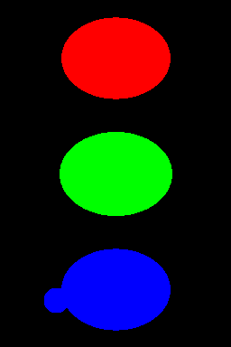

Let me illustrate what I was trying to say `in a comment
<http://metarabbit.wordpress.com/2013/09/11/nuclear-segmentation-in-microscope-cell-images/#comments>`__
to `João Carriço <https://twitter.com/jacarrico>`__:

Consider the following three shapes:

If the top (red) image is your reference and green and blue are two candidate
solutions, then *pixel counting* (such as Rand and Jaccard) will say that green
is worse than blue. In fact, green differs by 558 pixels, while blue only by
511 pixels.

However, the green image is simply a fatter version of red (with a circa 2
pixel boundary). Since boundaries cannot be really drawn at pixel level anyway
(it is a fuzzy border between background and foreground), it is not an
important difference. The blue image, however, has an extra blob and so is
qualitatively different.

The Hausdorff distance or my own *normalized sum of distances*, on the other
hand, would say that green is very much like red, while blue is more different.
Thus they capture the important differences better than pixel counting.

(Thanks João for prompting this example. I used this when I gave a talk or two
about this paper, but it was lost in the paper because of page limits.)

