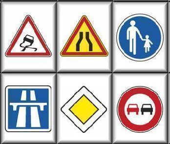

The False Hope of Usable Data Analysis

I changed the regular schedule of the posts because I wanted to write down
these ideas.

A few days ago, in a panel at `EuBIAS <http://eubias2013.irbbarcelona.org/>`__,
I argued again that scientists should learn how to programme. I also argued
that usability of bioimage analysis was a false hope.

Now, to be sure: *usability is great*, but *usability does not mean usable
without programming skills*. Good usable programming environments can be the
most usable way to achieve something [#]_.

(We can build communication systems without words, but only if the vocabulary
is very limited. Otherwise, people need to learn how to read [#]_.)

The problem is that *image analysis* (or *data analysis*) is not a closed goal.
Whatever we are doing today, will probably be packaged into simple-to-use
tools, but the problems will grow in size and complexity.

For a fixed target, like *sending email* or *writing a blog*, we can build nice
tools that don't require programming. Any modern email client basically does
email well enough. There is probably only a small set of behaviours we want our
blogs to do (like scheduling a post) and I think we can get a small set of
features that covers 90%+ of uses (small here might mean a few thousand of
plugins). There is no constant pressure to do 10 times more.

But *data analysis* is not in the same category as sending email. It's an
open-ended problem, which will grow continuously, which has been growing
continuously. Only a full-blown artificial intelligence system will be able to
deal with the sort of analysis that we will want to do in 10 years (or we
already want to do it, but are unable to do it because we do yet have the
technology).

If anything, I have felt more and more of a need to think in low-level terms
[#]_.

A few years ago, push-button analysis was sufficient for most problems. Load
your data into Excel, select the rows, and plot. Fit a line, compute some
stats. STATA gave you a bit more power if Excel did not suffice.  Now, the
problems grew and push-button solutions do not scale. Not only do we
have **more data**, we have **more complex, more unstructured** data.

A few years ago, people were writing things like *feel free to use
interpreted languages, it doesn't matter that you're losing performance
compared to C; computers are super-fast, waste them*. Now, there is much more
interest in building implementations that are *as fast as C* (normally using
Just-in-time compilation).

This will not get better and just saying that tools should be easier for
non-programmers is missing the point.

**Related**

`Bayes and Big Data
<http://vserver1.cscs.lsa.umich.edu/~crshalizi/weblog/1046.html>`__ by Cosma
Shalizi

`The Average is Over
<http://www.amazon.com/Average-Is-Over-Powering-Stagnation/dp/0525953736>`__ by
Tyler Cowen

.. [#] If you wish, read *scripting* for *programming*. I never cared much for
   this division.

.. [#] If you google for `traffic signs
   <https://www.google.de/search?q=traffic+signs&client=ubuntu&hs=f8d&channel=cs&source=lnms&tbm=isch&sa=X&ei=iY1VUqXSK4Wd7Qb1joGYBQ&ved=0CAkQ_AUoAQ&biw=1103&bih=528&dpr=1`>--__
   you'll see that actually most images have at least one sign with words or
   images.

.. [#] The need to managing parallelism (as our cores multiply, but not get
   faster) and memory access patterns as data grows faster than RAM have forced
   me to think about exactly what is happening in my machines.

