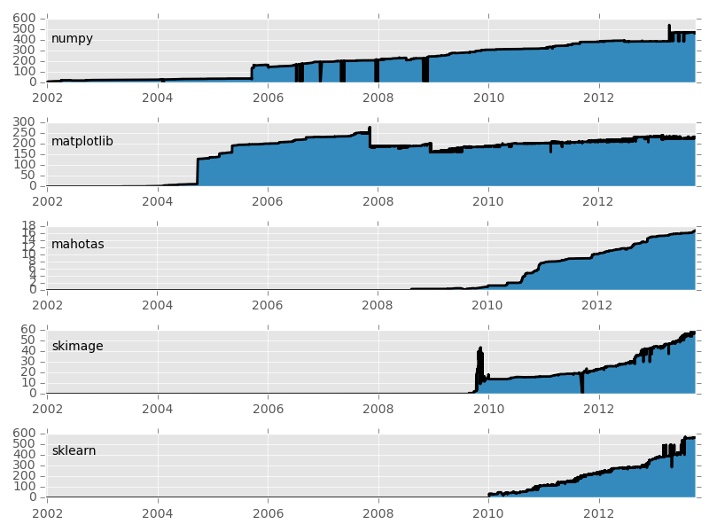

Why Python is Better than Matlab for Scientific Software

**0. My argument mostly applies for new projects**

If you have legacy code in MATLAB, then it may make sense to just continue
using it. If it works, don't fix it. However, if your Matlab code keeps causing
you pain, Python might be a solution.

Note too that porting code is not the same as writing from scratch. You can
often convert code from MATLAB to Python in a small fraction of the time it
would take you to start from scratch.

**1. Python has caught up with Matlab and is in the process of overtaking it.**

This is my main argument: the momentum is in Python's direction. Even two or
three years ago, Python was behind. Now, it's sailing past Matlab.

This graph shows the number of lines of code in some important projects for
bioimage informatics/science in general. As you can see, the base projects on
the top (numpy and matplotlib) have been stable for some years, while the more
applied packages at the bottom have exploded in recent years.

Depending on what you are doing, Python may even better support it.  It is now,
Matlab which is playing catch-up with open source software (for example, Matlab
`is now introducing <http://www.mathworks.nl/help/matlab/ref/table.html>`__
their own versions of a Dataframe, which Python has through Pandas, itself a
Python version of R's original Dataframe).

The Python projects are also newer and tend, therefore, to be programmed in a
more modern way: it is typical to find automated testing, excellent and
complete documentation, &c. This ain't your grandfather's open source with a
dump on sourceforge and a single README file full of typos.

As an example of the large amount of activity going on in the Python world,
just this week, `Yhat released ggplot for Python
<http://blog.yhathq.com/posts/ggplot-for-python.html>`__ [#]_. So, while last
week, I was still pointing to plotting as one of the weakneses of Python, it
might no longer be true.

**2. Python is a real programming language**

Matlab is not, it is a linear algebra package. This means that if you need to
add some non-numerical capabilities to your application, it gets hairy very
fast.

For scientific purposes, when writing a small specialized script, Python may
often be the second best choice: for linear algebra, Matlab may have nicer
syntax; for statistics, R is probably nicer; for heavy regular expression
usage, Perl (ugh) might still be nicer; if you want speed, Fortran or C(++) may
be a better choice. To design a webpage; perhaps you want node.js. Python is
not perfect for any of these, but is acceptable for all of them.

In every area, specialized languages are the best choice, but Python is the
second best in more areas [#]_.

**3. Python can easily interface with other languages**

Python can interfact with any language which can be interacted through C, which
is most languages. There is a missing link to some important Java software, but
some work is being done to address that too.  Technically, the same is true of
Matlab.

However, the Python community and *especially the scientific Python community*
has been extremely active in developing tools to make this as easy as you'd
like (e.g., `Cython <http://cython.org/>`__). Therefore, many tools/libraries
in C-based languages are already wrapped in Python for you.

**4. With Python, you can have a full open-source stack**

This means that you are allowed to, for example, ship a whole virtual machine
image with your paper. You can also see look at all of the code that your
computation depends on. No black boxes.

**5. Matlab Licensing issues are a pain. And expensive.**

Note that I left the word expensive to the end, although in some contexts it
may be crucial. Besides the basic MATLAB licenses, you will often need to buy a
few more licenses for specific toolboxes. If you need to run the code on a
cluster, often that will mean more licenses.

However, even when you do have the money, this does not make the problem go
away: now you need admin for the licensing. When I was at CMU, we had
campus-wide licenses and, yet, it took a while to configure the software on
every new users computer (with some annoying minor issues like the fact that
your username needed to match the username you had on campus), you couldn't run
it outside the network (unless you set up a VPN, and it still presupposed you
had network access), &c. Every so often, the license server would go down and
stop everybody's work. These secundary costs can be as large as the licensing
costs.

Furthermore, using Python means you can more easily collaborate with people who
don't have access to Matlab. Even with a future version of yourself who decided
to economize on Matlab licenses (or if the number of users shrinks and your
institution decides to drop the campus licensing, you will not be one of the
few groups now forced to buy it out-of-pocket).

By the way, if you do want support, there are plenty of options for purchasing
it [#]_: larger companies as well as individual consultants available in any
city. The issue of support is orthogonal to the licensing of the software
itself (however, because science is a third world economy, it may sometimes be
easier to spend 10k on a few matlab licenses and get some support than 2k for a
Python consultant).

§

Python does have weaknesses, of course; but that's for another post.

.. [#] Yhat is a commercial company releasing open-source software, by the way;
   for those keeping track at home.

.. [#] I rememeber people saying this about C++ back in the day.

.. [#] However, because science is a third-world econonmy, it may be easier to
   spend 10k on Matlab licenses which come with phone support to spending 1k on
   a local Python consultant.

