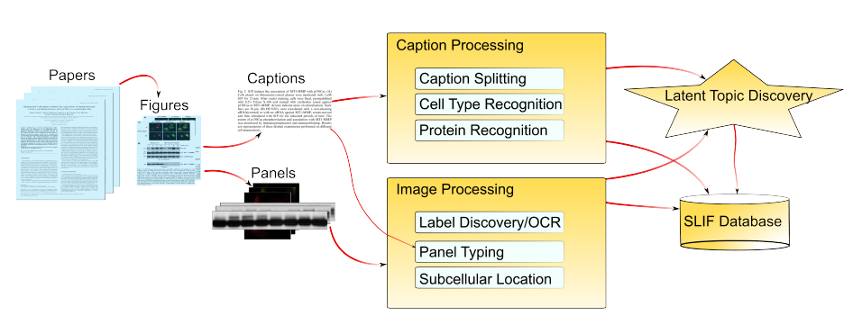

Still going down memory lane, I am presenting a couple of papers:

    Structured literature image finder: extracting information from text and
    images in biomedical literature LP Coelho, A Ahmed, A Arnold, J Kangas, AS
    Sheikh, EP Xing, WW Cohen, RF Murphy Linking Literature, Information, and
    Knowledge for Biology, 23-32 [`DOI
    <http://dx.doi.org/10.1007/978-3-642-13131-8_4>`__] [`Murphylab PDF
    <http://murphylab.web.cmu.edu/publications/157-coelho2009.pdf>`__]

    Structured literature image finder: Parsing text and figures in biomedical literature
    A Ahmed, A Arnold, LP Coelho, J Kangas, AS Sheikh, E Xing, W Cohen, RF Murphy
    Web Semantics: Science, Services and Agents on the World Wide Web 8 (2), 151-154
    [`DOI <http://dx.doi.org/10.1016/j.websem.2010.04.002>`__]

These papers refer to SLIF, which was the *Subcellular Location Image Finder*
and later the *Structured Literature Image Finder*.

The initial goals of this project were to develop a system which parsed the
scientific literature and extracted figures (including the caption). Using
text-processing, the system attempted to guess what the image depicted and
using computer vision, the system attempted to interpret the image.

In particular, the focus was on subcellular image analysis for different
proteins from fluorescent micrographs in published literature.

§

Additionally, there was a topic-model based navigation based on both images and
the caption-text. This allowed for latent model based navigation.
Unfortunately, the site is currently offline, but our user-study showed that it
was a meaningful navigation model.

§

The final result was a proof-of-concept system. Most of the subsystems worked
at reasonably high accuracy, but it was not sufficient for the overall
inferrences to be of very high accuracy (if there are six steps in an inferene
step and each has 90% accuracy, then you are just about 50/50, which is much
better than random guessing in large inference spaces, but still not directly
trustable).

I think the vision is still valid and eventually the technology will be good
enough. There is a lot of information inside the biological literature which is
not always so obvious to get at and that much of this is in the form of image.
SLIF was a first stab at getting at this data in addition to the text-based
approaches that are more well known.

§

`More information about SLIF <http://murphylab.web.cmu.edu/services/SLIF2/>`__
(including references to the initial SLIF papers, of which I was not a part).

