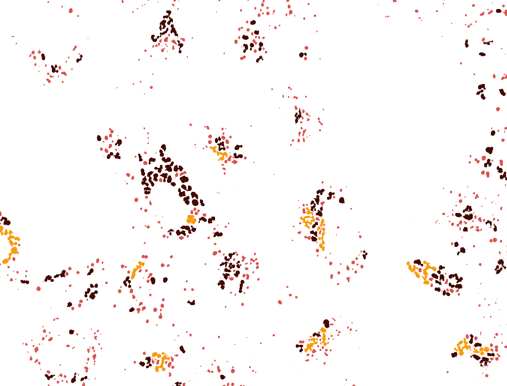
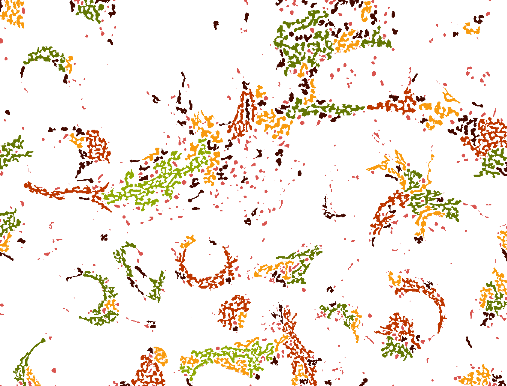
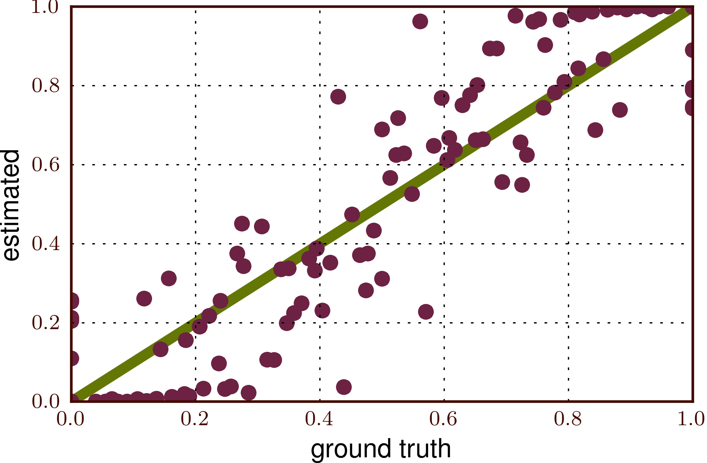

Unsupervised subcellular pattern unmixing. Part II

On Friday, I presented the pattern unmixing problem. Today, I'll discuss how we
solved it.

    Coelho, Luis Pedro, Tao Peng, and Robert F. Murphy. “Quantifying the
    Distribution of Probes Between Subcellular Locations Using Unsupervised Pattern
    Unmixing.” Bioinformatics 26.12 (2010): i7–i12. `DOI:
    10.1093/bioinformatics/btq220
    <http://doi.org/10.1093/bioinformatics/btq220>`__

The first step is to extract objects. For this, we use a combination of global 
& local thresholding: this means that a pixel is on if it is both above a
global threshold which identifies the cells from the background and a local
threshold (which identifies subcellular objects [#]_).

We then group the objects found using k-means clustering. Here is what we
obtain for a lysosomal picture (different colours mean different clusters)
[#]_.

and the equivalent for the mitochondrial image:

You will see that the mitochondrial image has many green things and less dark
purple objects, but both mitochondrial and lysosomal images have all of the
groups. Now (and this is an important point): **we do not attempt to classify
each individual object, only to estimate the mixture**.

§

Of course, if we had the identity of each object, the mixture would be
trivially estimated. But we do not need to identify each object. In fact, to
attempt to do so would be a gross violation of Vapnik's Dictum (which says *do
not solve, as an intermediate step, a harder problem than the one you are
trying to solve*). It is easier to just estimate the mixtures [#]_.

In this formulation it might not even matter much that some of the *objects* we
detect correspond to multiple biological objects!

§

How do we solve the mixture problem? Latent Dirichlet allocation or basis
pursuit. The details are in the paper, but I will jump to the punchline.

We tested the method using a dataset where we had manipulated the cell tagging
so we know the ground truth (but the algorithm, naturally, does not see it). On
the graph below, the x-axis is the (hidden) truth and the y-axis is the
automated estimate. In green, the perfect diagonal; and each dot represents one
condition:

§

I will note that each individual dot in the above plot represents several
images from each condition. On a single image (or single cell) level the
prediction is not so accurate. Only by aggregating a large number of objects
can the model predict well.

This also points out why it may be very difficult for humans to perform this
task (nobody has tried to do it, actually).

.. [#] A global threshold did not appear to be sufficient for this because
   there is a lot of in-cell background light (auto-fluorescence and auto-focus
   light).

.. [#] For this picture, I used 5 clusters to get 5 different colours. The real
   process used a larger number, obtained by minimising BIC.

.. [#] Sure, we can then reverse engineer and obtain a probability distribution
   for each individual object, but that is not the goal.
