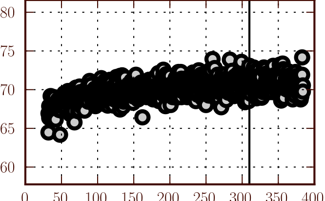

FAQ: How Many Clusters Did You Use?

    Luis Pedro Coelho, Joshua D. Kangas, Armaghan Naik, Elvira Osuna-Highley,
    Estelle Glory-Afshar, Margaret Fuhrman, Ramanuja Simha, Peter B. Berget,
    Jonathan W. Jarvik, and Robert F.  Murphy, *Determining the subcellular
    location of new proteins from microscope images using local features* in
    Bioinformatics, 2013 [`Advanced Access
    <http://dx.doi.org/10.1093/bioinformatics/btt392>`__]
    
    Coelho, Luis Pedro, Tao Peng, and Robert F. Murphy. “Quantifying the
    Distribution of Probes Between Subcellular Locations Using Unsupervised Pattern
    Unmixing.” Bioinformatics 26.12 (2010): i7–i12. `DOI:
    10.1093/bioinformatics/btq220
    <http://doi.org/10.1093/bioinformatics/btq220>`__

Both of my Bioinformatics papers above use the concept of `bag of visual words
<http://en.wikipedia.org/wiki/Bag-of-words_model_in_computer_vision>`__. The
first for classification, the second for `pattern unmixing
<http://metarabbit.wordpress.com/2013/11/15/old-work-unsupervised-subcellular-pattern-unmixing/>`__.

Visual words are formed by clustering local appearance descriptors. The
descriptors may have different origins (see the papers above and the references
below) and the visual words are used differently, but the clustering is a
common intermediate step.

A common question when I present this work is *how many clusters do I use?*
Here's the answer: *it does not matter too much*.

I used to just pick a round number like 256 or 512, but for the local features
paper, I decided to look at the issue a bit closer. This is one of the panels
from the paper, showing accuracy (y-axis) as a function of the number of
clusters (x-axis):

As you can see, if you use enough clusters, you'll do fine. If I had extended
the results rightwards, then you'd see a plateau (read the full paper &
supplements for these results) and then a drop-off. The green line is N/4,
where N is the number of images in the study. This seems like a good heuristic
across several datasets.

One very interesting result is that **choosing clusters by minimising AIC can
be counter-productive**! Here is the killer data (remember, we would be
**minimizing the AIC**):

Minimizing the AIC leads to lower accuracy! AIC was never intended to be used
in this context, of course, but it is often used as a criterion to select the
number of clusters. I've done it myself.

**Punchline**:
If doing classification using visual words, minimsing AIC may be *detrimental*,
try using N/4 (N=nr of images).

**Other References**

This paper (reviewed before on this blog) presents supporting data too:

.. raw:: html

   Noa
   Liscovitch, Uri Shalit, & Gal Chechik (2013). FuncISH: learning a functional
   representation of neural ISH images Bioinformatics DOI: <a rev="review"
   href="http://dx.doi.org/10.1093/bioinformatics/btt207">10.1093/bioinformatics/btt207</a>

