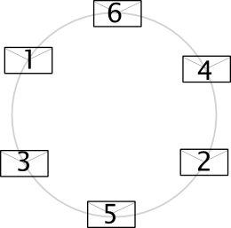

Paper-Based Secret Santa Protocol

From the *computer science is not about computers* bureau:

It's that time of year, when it is cold outside, the ground starts be be
covered in snow, and people gather around, drinking hot drip coffee in
fluorescently-lit rooms, and organize the *office secret Santa*.

I present here a protocol to organize secret Santa exchange with pen & paper
for a small group of people.

*Materials*: for each participant, you need 1 envelope and 2 index cards.
These may be small, but the index card needs to fit inside the envelope.

**Step 1**: Assign every participant a number between 1 and n so that only they
know their number [#]_. For this, number the envelopes [#]_, shuffle them
face-down and distribute them face down.

At the end of step 1, everybody has an envelope with a different number on the
outside, which only they know. They need to remember it for the next step.

**Step 2**: Assign gifters by number.

*Step 2.1* Each person writes their name on an index card, puts the card inside
their envelope and puts the envelope back in the centre face down.

*Step 2.2* Gather and shuffle the envelopes such that nobody sees who had which
envelope.

*Step 2.3* Put the envelopes in a circle facing up. The numbers are visible to
the outside. Use the *clockwise rule* to assign gifters.

In the above circle, 6 will give a gift to 4, 4 to 2, 2 to 5, &c, and 1 to 6.

Everyone now knows the number of the person for whom they will be getting a
gift. The identity of the person is inside the envelope.

For the next step, everybody needs to remember *the number of the person
assigned to them*.

**Step 3**: Make the identities known on a *need to know basis*.

*Step 3.1* Everybody picks up the closest envelope to them. **Not necessarily
the one that they need to know about**! (Otherwise, the identities would become
known). Everyone should have a blank index card in their possession too.

*Step 3.2* Now, everybody looks at their envelope number.

If this is the envelope with the identity of the person they need to know, then
they *discreetly* replace the index card inside by a blank. If not, they go
through the motions of replacing the index card, but do not do anything. This
means that everybody picks up an envelope, hides it under the table for 5 to 10
seconds and fiddles with it (perhaps having switched the index card).

*Step 3.3* Pass your envelope to the person to your left and repeat 3.2.

When the cards have all gone around once, everyone should have been able to
pick up their target envelope and have switched the index card.

Everybody knows the identity of their target (it's the person whose name is on
the index card they picked up in 3.2) and nothing else. Success!

§

Instead of blank index cards in step 3, you can use exactly *n* index cards
with a hard to reproduce mark of some sort. Thus, at the end, you can check
whether somebody cheated by opening all the envelopes and seeing whether you
have the original cards back [#]_.

§

.. image:: http://imgs.xkcd.com/comics/travelling_salesman_problem.png

Or just use http://www.secretsanta.com/

.. [#] Feel free to use a 0-based numbering system, if it's that sort of crowd.

.. [#] You can just give everyone an envelope, number the people clock-wise and
   put the envelopes back in the centre. The protocol is resistant to guessing
   the handwriting as after shuffling, you will probably not get the same
   number.

.. [#] Wet the corners with coffee and let them dry, for example. As long as
   nobody can prepare a copy ahead of time or fake it in the 10 minutes it
   takes to play this game, it doesn't need to be cryptographic.

