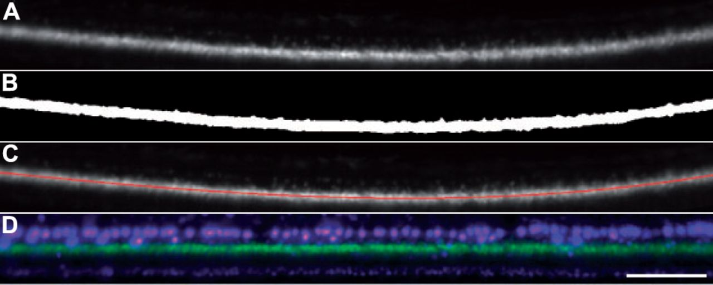
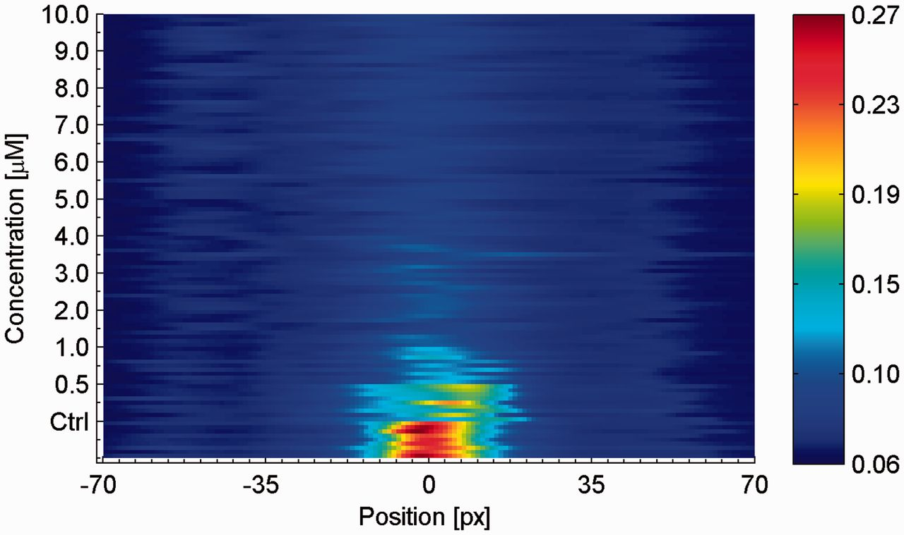

Paper Review: Automated prior knowledge-based quantification of neuronal
patterns in the spinal cord of zebrafish

    *Automated prior knowledge-based quantification of neuronal patterns in the
    spinal cord of zebrafish* by Johannes Stegmaier, Maryam Shahid, Masanari
    Takamiya, Lixin Yang, Sepand Rastegar, Markus Reischl, Uwe Strähle, and
    Ralf Mikut. in Bioinformatics [`DOI
    <http://doi.org/10.1093/bioinformatics/btt600>`__]

It's been a while since I've had a paper review, even though one of my goals is
to give more space to bioimage informatics. So, this is a paper which is not
exactly hot off the press (it came out two months ago), but still very recent.

The authors are working with zebrafish. Unfortunately, I am unable to evaluate
the biological results as I do now know much about zebrafish, but I can
appreciate the methodological contributions.

Here is Figure 2 in the paper

The top panel is the data (a fish spinal coord, cropped out of a larger field),
the next two a binarization of the same data and a line fit (in red). Finally,
the bottom panel shows the effect of *straightening* the image to a line. This
allows for comparison between different images by morphing them all to a common
template. The alignment is peformed on only one of the channels, while the
others can carry more information.

§

This is very similar to work that has been done in straightening C. elegans
images (e.g., `Peng et al., 2008
<http://bioinformatics.oxfordjournals.org/content/24/2/234.full>`__) in both
intent and some of the general methods (although there you often morph the
whole space instead of just a band of interest). It is a bit unfortunate that
the bioimage informatics literature sometimes aggregates by model system when
many methods can profitably be used across problems.

§

Finally, I really like this visualization, but I need to give you a bit of
background to explain it (if I understood it correctly). Once a profile has
been straightened (panel D in the figure above), you can summarize it by
averaging along the horizontal dimension to get the average intensity at each
location (where zero is the centre of the spinal coord) [#]_. You can then
stack these profiles (analogously to what you'd do to obtain a kinograph) as a
function of your perturbation (in this case, a drug concentration):

§

As a final note, I'll leave you with this quote from the paper, which validates
some of what I said before: `the quality of human evaluation is consistently
over-estimated
<http://metarabbit.wordpress.com/2013/10/04/seeing-is-believing-which-is-dangerous/>`__:

    Initial tests unveiled intra-expert and inter-expert variations of the
    extracted values, leading to the conclusion that even a trained evaluator
    is not able to satisfactorily reproduce results. 

.. [#] The authors average a different marker than the one used for
   straightening, but since I know little about zebrafish biology, I focus on
   the methods.

