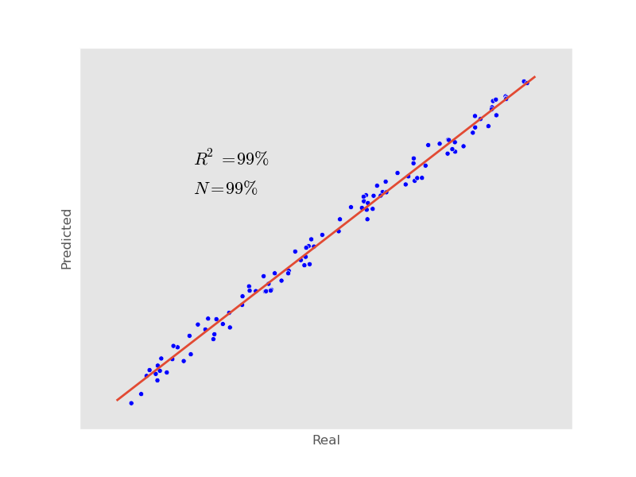
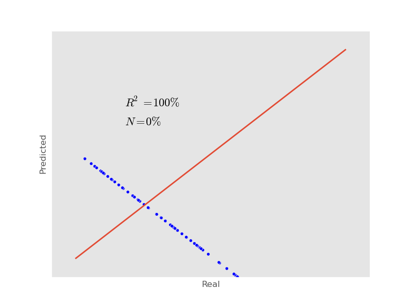
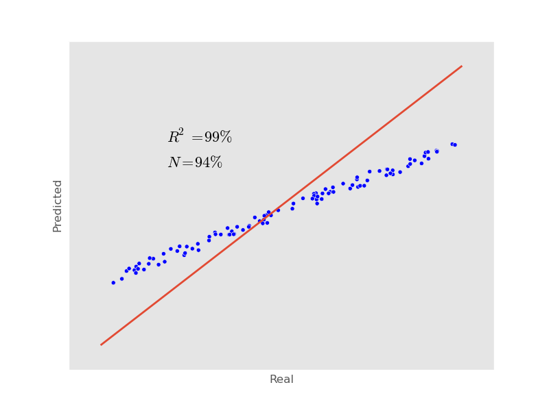
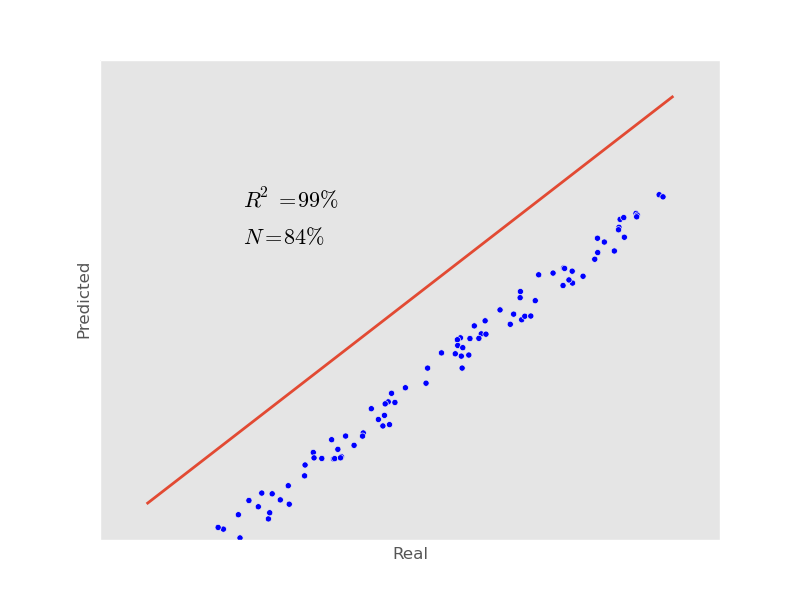

I have been doing a bit of regression 

Most literature on regression comes from statisticians, not machine learning
people. Perhaps for this reason, there is less emphasis on training/testing
separation or cross-validation.

In particular, I have been thinking about how to get a general purpose measure
of "how well can we predict this output." Mean squared error
(:math:`\frac{1}{N} \sum (\hat{y}_i - y_i)^2`, where :math:`\hat{y}_i` is the
cross-validated predictions for input :math:`i`) has some nice properties.
However, it is meaningless as a number and it would be nice to normalize it.
   
What seems the most meaningful normalization is to use a *null model* which
consists of outputting the mean of the training data. To make higher numbers be
better, I first flip it around:

.. math::

    1 - \frac{ \sum (\hat{y}_i - y_i)^2 }{\sum (y_i - \bar{y})^2}

The result can even be negative if the prediction is harmful. So, I actually
want to use

.. math::

    N(\hat{y}, y) = \max \{ 1 - \frac{ \sum (\hat{y}_i - y_i)^2 }{\sum (y_i - \bar{y})^2}, 0 \}

This value is 0 for a meaningless prediction, 1 for a perfect one.

I am calling it :math:`N` for *normalized error reduction*. In fact, I've tried
looking and `asking around
<http://stats.stackexchange.com/questions/87481/what-is-this-measure-called-mse-divided-by-variance-of-dependent-variable>`__
for a literature name. So far, I have not found one.

§

In the case of a positive correlation with no bias, this reduces to the
R-squared between :math:`\hat{y}` and :math:`y`, also known to as the explained
variance.

I like to look at the results in plots like this one

On the x-axis, I have the underlying output, and on the y-axis, the
cross-validated (or out-of-bag prediction) for each sample. I also plot the
diagonal. In this case, the prediction is very good and there is only a little
noise pushing points away from the diagonal.

§

However, it does not reduce the R-squared in a few interesting cases:

1. The model does not predict at all.

Let's say that your output cannot be explained by the input at all. To simplify
things, let's assume you don't even have an input, just a set of outputs,
:math:`\{ y_1 .. y_N \}`, which you predict as the mean in the training set.

If you use leave-one-out-cross-validation (LOOCV), then this null-prediction
has perfect (negative) correlation with the input (see also `here
<http://www.russpoldrack.org/2012/12/the-perils-of-leave-one-out.html>`__ and
`here <http://not2hastie.tumblr.com/>`__! Its R-squared is 1!

If you are using LOOCV, then you'll probably see this and catch it, but it
might slip by if your using 10 folds and you don't have a lot of data and
accidently report it as low-but-significant (with 100 datapoints, and uniformly
sampled :math:`y_i`, the R-squared is different from zero, with p-value < 0.05,
90% of the time! 25% of the times, the p-value is below 0.0001)

2. Reversion to the mean models.

This is an instance of where your model was oversmoothed.

In this instance, your model predicts in the right direction, but it
underpredicts. However, if you just report R-squared of the prediction, you'll
lead your readers to think you can predict very well.

It's not always the case that you could just have gone back and multiplied all
your coefficients by a number larger than 1. It may be that to get the larger
coefficients would imply that you would get noise in the output. This would not
happen in traditional regression problems, but in :math:`p > n` settings, where
penalized regression is necessary, it can and does happen.

3. Biased models

If your models are biased, this naturally introduces a penalty. R-squared is
invariant to addition (:math:`R2(\hat{y} + B, y) + R2(\hat{y}, y)`), but N is
not. In fact, if the correlation is positive,

.. math::

    R2(\hat{y}, y) = \max_B N(\hat{y} + B, y).

I most often see this when comparing human annotations. People have very
similar trends, but one of the operators will consistenly report a lower value.

In some cases this may not matter and in others it will (if Matt always needs
to give a bigger discount than John to get a sale, this does not mean that Matt
and John are equivalent salesman).

