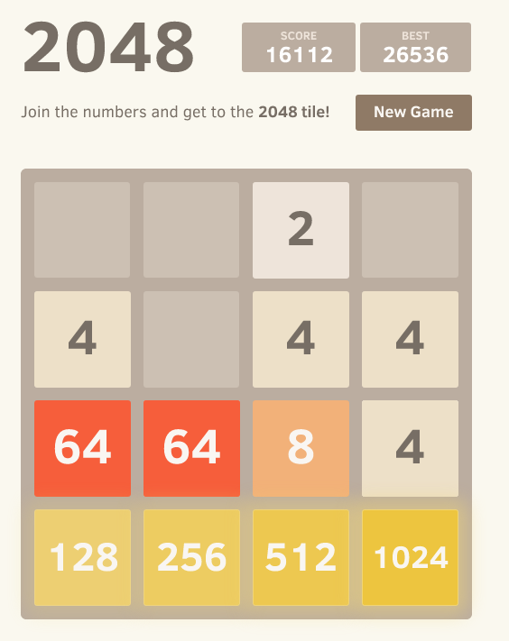

How to win at 2048 or why 2048 is a stupid game

(This post contains a 2048 spoiler)

I too was caught up in craze about `2048
<http://gabrielecirulli.github.io/2048/>`__. Unfortunately, after a while I
realised it's a stupid game. It's a stupid game, because it's actually a
puzzle. Once you figure out how to play it [#]_, there is no challenge, it's
just trivial and boring.

2048 becomes `cow clicking <http://en.wikipedia.org/wiki/Cow_Clicker>`__ in
binary.

**How to win at 2048**: play without ever pressing the UP key and keep your
largest values on the bottom row, aligned left-to-right [#]_. Just make sure
you keep your highest tile on the corner and keep feeding the bottom row as
best as you can. The newly born 2s & 4s will appear on the top portion and you
will always be able to put them together. The only dangerous moment is when you
score at the bottom as you risk destroying the organization if you're not
careful.

Above is how the board looks just before scoring the 2048 tile: Now go left,
down, right, right, right, and you will have clicked all your cows.

.. [#] Or at least one way of playing it.

.. [#] This strategy can, of course

