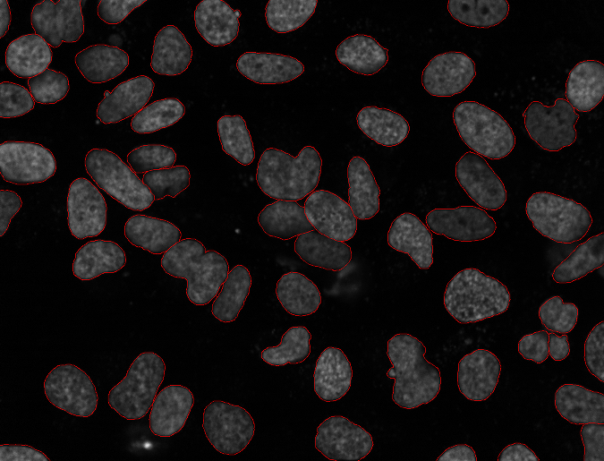

I decided to blog all my old papers (from when I did not have a science blog).
Expect the next few weeks to go back to the past.

I will start with this one:

    NUCLEAR SEGMENTATION IN MICROSCOPE CELL IMAGES: A HAND-SEGMENTED DATASET
    AND COMPARISON OF ALGORITHMS by *Luis Pedro Coelho, Aabid Shariff, and
    Robert F. Murphy* in Biomedical Imaging: From Nano to Macro, 2009. ISBI
    '09. IEEE International Symposium on, 2009. DOI: `10.1109/ISBI.2009.5193098
    <doi.org/10.1109/ISBI.2009.5193098>`__ [`Pubmed Central open access version
    <http://www.ncbi.nlm.nih.gov/pmc/articles/PMC2901896/>`__]

It's more of a solid paper than a break-through one, so it is interesting that
this is currently my most cited paper (according to `Google Scholar
<http://scholar.google.com/citations?user=qTYua0cAAAAJ&hl=en>`__).

The original question of this paper was very simple: *is it worth it to code up
and run a complex segmentation algorithm over a simple one on that we were
working with?*

I hand-segmented a bunch of images from our datasets. Frankly, if I knew how
much work this would take; I'd not have done it. And I would not have written
this paper. I believe that this is why it became widely cited: a lot of people
understand the value of the dataset (and use it for their work).

At the centre of the paper, we presented images such as this one, which had
been manually segmented (by me and a subset by Aabid Shariff, according to the
`label it twice principle <http://metarabbit.wordpress.com>`__):

We then implemented some automatic segmentation algorithms and measured which
were best able to reproduce the human labeled data.

The method who one was by `Lin et al. <>`__, which is a model-based method.

Another interesting result is that **the mean pixel value is a very good
threshold for fluorescent microscopy**.

Here is the `reproducible research archive for this paper
<https://github.com/luispedro/segmentation>`__.

