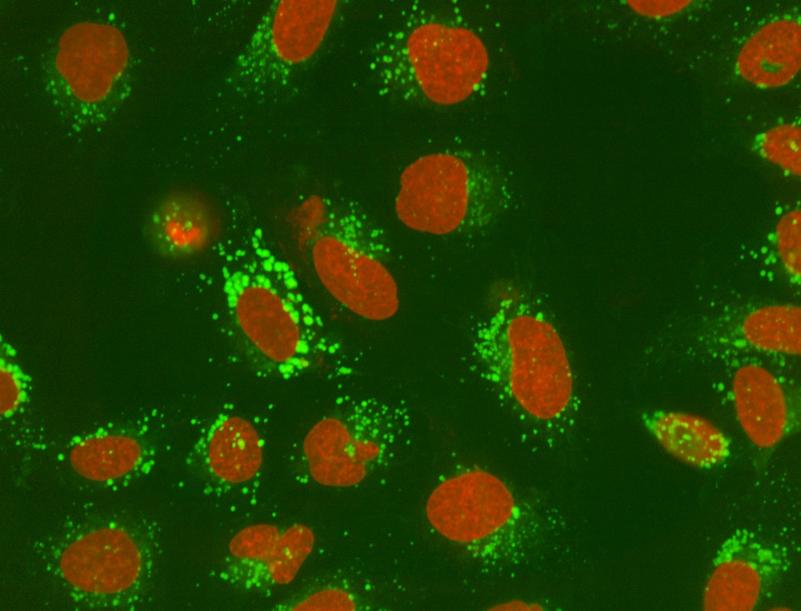
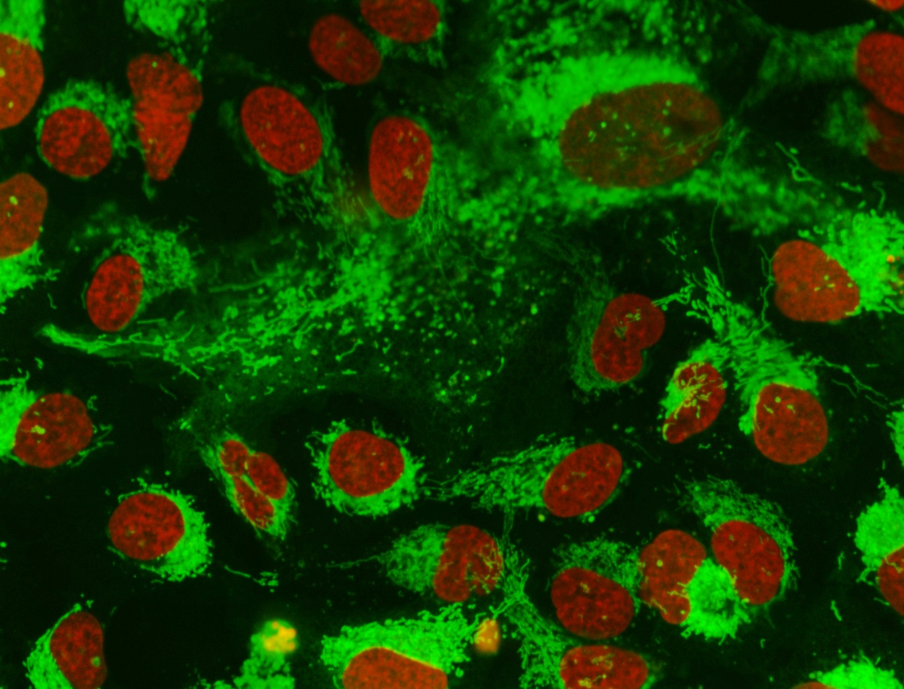
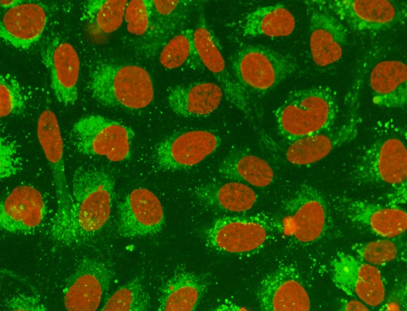

Continuing down nostalgia lane, here is another old paper of mine:

    Coelho, Luis Pedro, Tao Peng, and Robert F. Murphy. “Quantifying the
    Distribution of Probes Between Subcellular Locations Using Unsupervised Pattern
    Unmixing.” Bioinformatics 26.12 (2010): i7–i12. `DOI:
    10.1093/bioinformatics/btq220
    <http://doi.org/10.1093/bioinformatics/btq220>`__

I have already discussed the subcellular location determination problem. This
is *Given images of a protein, can we assign it to an organelle?*

This is, however, a simplified version of the world: many proteins are present
in multiple organelles. They may move between organelles in response to a
stimulus or as part of the cell cycle. For example, here is an image of
mitochondria in green (nuclei in red):

Here is one of lysosomes:

And here is a mix of both!:

This is a dataset constructed for the purpose of this work, so we know what is
happening, but it simulates the situation *where a protein is present in two
locations simultaneously*.

Thus, we can move beyond simple assignment of a protein to an organelle to
assigning it to multiple organelles. In fact, some work (both from the Murphy
group and others) has looked at subcellular location classification using
multiple labels per image. This, however, is still not enough: we want to
quantify this.

This is the **pattern unmixing problem**. The goal is to go from an image (or a
set of images) to something like the following: *This is 30% nuclear and 70%
cytoplasmic*, which is very different from *70% nuclear and 30% cytoplasmic*.
The basic organelles can serve as the base patterns [#]_.

Before our paper, there was some work in approaching this problem from a
*supervised* perspective: Given examples of different organelles (ie, of
markers that locate to a single organelle), can we automatically build a system
which when given images of a protein which is distributed in multiple
organelles, can figure out which fraction comes from each organelle?

Our paper extended this to work To the *unsupervised case*: can you learn a
mixture when you **do not** know which are the basic patterns?

**References**

`Determining the distribution of probes between different subcellular locations
through automated unmixing of subcellular patterns
<http://dx.doi.org/10.1073/pnas.0912090107>`__ Tao Peng, Ghislain M. C. Bonamy,
Estelle Glory-Afshar, Daniel R. Rines, Sumit K. Chanda, and Robert F. Murphy
PNAS 2010 107 (7) 2944-2949; published ahead of print February 1, 2010,
doi:10.1073/pnas.0912090107

`Object type recognition for automated analysis of protein subcellular location
<http://scholar.google.com/citations?view_op=view_citation&hl=en&user=qQLlBH4AAAAJ&cstart=40&citation_for_view=qQLlBH4AAAAJ:L8Ckcad2t8MC>`__
T Zhao, M Velliste, MV Boland, RF Murphy Image Processing, IEEE Transactions on
14 (9), 1351-1359

.. [#] This is still a limited model because we are not sure even how many base
   patterns we should consider, but it will do for now.

.. 

    I was pretty happy about these results, so were the other co-authors, we
    thought they were great, Nature Biotechnology agreed and mentioned it in
    positive terms... and nobody cited it for the longest time. Then, they did,
    and all was well.

