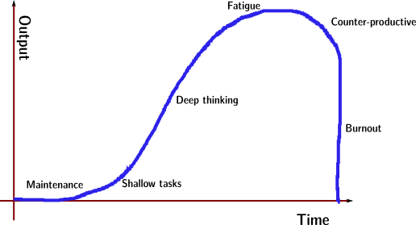

I've lately seen some discussions of productivity and they often seem to refer
to the widget cranking model of productivity even whilst claiming not to do so!

§

This is the productivity model I typically see discussed (or assumed):

On the x-axis, I plot time spent working; on the y-axis I plot *output* (total
output, not productivity, which would be the derivative).

In this model, when you work 20 hours a week, you are super productive and can
output more than double what you can output when you work 40 hours a week. As
working time goes up, fatigue sets in and less is produced per hour until it
actually becomes counter-productive including a steep-decline as the worker
burns out or just commit egregious mistakes [#]_.

This is the widget cranking model and it applies to factory workers assembling
iPhones, or baristas at a coffee store, with small modifications (see below) it
apply to office workers. It does not apply to certain types of
highly-intellectual workers working in a modern organization [#]_.

§

My personal impression is that my personal productivity is much more like this:

The first few hours of the week are zero-output. This is *Maintenance*. These
including attending seminars, reading papers, reading department announcement
emails, filling out paperwork, attending training sessions on how to fill out
paperwork, some of the meetings I attend, &c. I could do this for years and
nothing would come out. Sure, I'd be informed of the literature from reading
papers, I'd know what all of the week's speakers are and I'd have no unread
emails on my inbox; but this would not get a single paper published, a single
talk given, a single student taught.

Next, there are the *Shallow Tasks*, the stuff that produces some output, but
is not really very challenging or produces very high impact output: answering
work emails, (re-)giving talks on work already done, merging text edits from
co-authors. These basic tasks can take a few hours every week. Sometimes they
take away a whole month.

If all your tasks are of this form then the widget model may apply to you after
the Maintenance phase, which in a well-run organization can be 5 hours per week
or less [#]_. I think this actually describes many office jobs, which are done
with the brain, but do not require that much creativity, insight or deep
knowledge of a field. It may even describe a lot of the work done by doctors
seeing patients (although less now than it did in the past). I can certainly
teach a class in shallow mode (probably won't be my best work, but I can do
it). However, if you have a really intellectually intensive job, which requires
creativity, shallowing it will not do.

In my line of work, research, shallowing is not enough. At some point, you need
more and faster progress. You need deep thinking and breakthroughs.

However, and this is the important point of this model, I **cannot do deep
thinking on a cold cache**. I can only really get there when I have wrapped my
head around the details of a project/problem. This is best achieved as a
side-effect from working on shallow tasks or from failed attempts at
breakthroughs. It takes some time and it does not lend itself to being
partitioned into discrete tasks spread through a long period of time (a few
hours every week).

When I switch projects to something I have not worked at for a while [#]_, it
sometimes **takes me a full week or more just to get the details back in my
head**. Even coming back from the week-end, it takes a few hours to get back to
where I was on Friday [#]_. I sometimes think I've got it and then make silly
mistake because I forgot that in this particular project, some aspect was done
slightly differently from usual so I waste a full day on something stupid; I
spend more time looking up basic information, I make changes to code which need
to be reverted because I forgot why the code was
doing what it was doing or I write some text which I delete without even
sharing because it had forgotten an important aspect of the problem. (For the
programmers in the audience, think about switching to a programming language
you know well but have not used for a few months. You are now calling the
``size`` method instead of ``length`` to get the number of elements of a
vector, looking up library functions you used to know by heart, your fingers
will no longer automatically type build system commands, &c)

Only when I finally have the project in my head, does the typical widget model
fully apply to me: *breakthroughs* are now easy and I am very productive for
the first few hours of investment. I can manipulate the concepts in your head
and translate them to actual analysis, I remember pitfalls automatically, do
not fall through them, and things are good. I can try new things easily without
breaking up everything else (of course, they are not all successful attempts,
but I am iterating fast).

However, I cannot get to this phase without a preparatory phase. I often have
my best ideas on the bus. I have been struggling with something for the whole
afternoon, and on the bus on my way home, I finally see the solution. However,
**if I just rode the bus around town all day, I would not be very productive**.
Loading the project into memory is a vital phase of the process. Only then can
I make the insightful leaps.

Later comes fatigue and breakdown when mistakes accumulate and I can't spell
anymore [#]_.

§

In this model, although we still have diminishing returns at the right end of
the curve; we have increasing returns at the left end. **Working half the time
produces less than half of the output**, working a quarter of the time produces
almost nothing.

§

In this model, `Average is Over
<http://en.wikipedia.org/wiki/Average_is_Over>`__. The 40 hour week is over,
there will be those who work 20 to 30 hours (those who are on the top curve)
and those who work 50 to 60 (those who are on the bottom curve).

In this model, it makes sense for widget makers to work fewer hours as society
gets rich (they are cashing in on society's wealth in the form of leisure),
while the elites work more hours for much more money. You cannot be a part-time
C-level executive, part-time quant trader, part time cutting-edge-scientist at
a big institution. You can, however, be a part time barista or HR officer.

In this model, for certain careers, it is hard to cash on society's wealth by
working fewer hours, except if you take advantage of a loophole: you take long
breaks or vacations. Not some puny two- or three-weeks in the Summer every year
or something 20th century like that (which require another week or so of
catching up time when you get back). Sure you might do a week in in Florida
(Lanzarote, for Europeans) when the fancy strikes and visit the in-laws for the
holidays, but I meant that you take some real time off, like a few months to go
live in Asia (or `volunteer in Africa <http://beiraproject.org/>`__). You take
a year off to walk from Alaska to Peru. Then you go back and work 60-hour weeks
at a hedge fund again, until you take your next six months off.

I think that this back-n-forth between apparent-workaholism and long breaks is
both more rational in this model and better describes the life-styles of the
modern elites.

The poor may work in the morning, fish in the afternoon, and criticize in the
evening [#]_; the rich will work one year, fish the next one, and criticize (go
into politics) a decade later.

.. [#] It may apply to certain types of gentleman scholar work such as a writer
   who writes his best work before lunch and takes the afternoons off.

.. [#] I purposefully left out values out of these plots. Some have claimed
   that 40 hours is the peak output (on average). Perhaps that is true, but it
   feels a bit Panglossian to me (it would also mean that the historical fights
   for the 40 hour work-week were based on a mistake on the part of the
   employers fighting to get their employees to work longer hours: they'd get
   more output while paying them less by switching to 40 hours, but the unions
   had to fight them for it). On the other hand, I know my peak is way beyond
   40 hours, so I might just be generalizing from N=1.

.. [#] In a badly run organization, this can take much longer.

.. [#] The common English idiom is *working on*, but many times research feels
   more like *working at* problems than *working on* them.

.. [#] Which is why context switches can be so painful. Not interruptions per
   se, but context switches.

.. [#] Actually, I can't spell at all in any language at any time of day; but
   you get the point.

.. [#] I mean material-poor relative to the very rich. This can apply to people
   with very rich lives who are part of the global 1% of income (you need
   34k/year to be in the global 1%).

